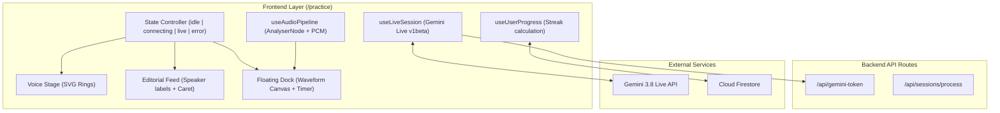

# French Practice Experience & Live Session Redesign Implementation Plan

> **For agentic workers:** REQUIRED SUB-SKILL: Use superpowers:subagent-driven-development to implement this plan task-by-task. Steps use checkbox (`- [ ]`) syntax for tracking.

**Goal:** Transform `/practice` into an editorial Swiss conversational workspace with dynamic voice stage, Gemini 3.8 Live real-time audio and bidirectional transcription, real Firestore streak calculation, and active waveform visualizer.

**Architecture:** A robust audio pipeline (`useAudioPipeline`) incorporating Web Audio `AnalyserNode` for 60fps canvas visualization, an upgraded `useLiveSession` hook targeting Gemini Live `v1beta` with input/output transcription, a persistent `useUserProgress` hook for authentic streak metrics, and an editorial React interface structured around single-viewport state transitions.

**Architecture Diagram:**



**Tech Stack:** Next.js 16 (App Router), React 19, Tailwind CSS v4, Web Audio API, `@google/genai`, Firebase Firestore, Vitest.

**Spec:** `docs/superpowers/specs/2026-10-08-french-practice-redesign-design.md`

## Global Constraints
- Node version: `>=20.x`
- Visual styling: Strict monochromatic palette (`#FFFFFF`, `#18181B`, `#71717A`), zero emojis, Lucide icons only.
- Typography: 3-font system (`Syne`, `Inter`, `IBM Plex Mono`).
- Testing: TDD for all hooks and API integration logic, `pnpm vitest run` must pass with 0 failures.

---

### Task 1: Persistent Streak & User Progress Hook (`useUserProgress`)

**Files:**
- Create: `hooks/useUserProgress.ts`
- Test: `tests/user-progress.test.ts`

**Interfaces:**
- Produces: `useUserProgress()` providing `{ progress, recordSessionCompletion, loading }` with automatic Firestore synchronization and localStorage fallback.

- [ ] **Step 1: Write the failing test**
Create `tests/user-progress.test.ts` testing streak increment, retention on same-day practice, and reset when days are skipped.

- [ ] **Step 2: Run test to verify it fails**
Run: `pnpm vitest run tests/user-progress.test.ts`
Expected: FAIL (hook does not exist).

- [ ] **Step 3: Write minimal implementation**
Implement `hooks/useUserProgress.ts` with Firestore `setDoc`/`getDoc` and `localStorage` mirror.

- [ ] **Step 4: Run test to verify it passes**
Run: `pnpm vitest run tests/user-progress.test.ts`
Expected: PASS

- [ ] **Step 5: Commit**
```bash
git add hooks/useUserProgress.ts tests/user-progress.test.ts
git commit -m "feat: implement useUserProgress hook with authentic streak calculation"
```

---

### Task 2: Upgraded Audio Pipeline with AnalyserNode (`useAudioPipeline`)

**Files:**
- Modify: `hooks/useAudioPipeline.ts`
- Test: `tests/audio.test.ts`

**Interfaces:**
- Produces: `getAudioLevels(): { inputLevel: number, outputLevel: number, timeDomainData: Uint8Array }` for high-performance canvas waveform rendering without React state latency.

- [ ] **Step 1: Write the failing test**
Add tests in `tests/audio.test.ts` verifying that `AnalyserNode` instances are initialized for both input recording and output playback.

- [ ] **Step 2: Run test to verify it fails**
Run: `pnpm vitest run tests/audio.test.ts`
Expected: FAIL

- [ ] **Step 3: Write minimal implementation**
Connect `AnalyserNode` to input stream and output destination in `hooks/useAudioPipeline.ts` and expose `getAudioLevels`.

- [ ] **Step 4: Run test to verify it passes**
Run: `pnpm vitest run tests/audio.test.ts`
Expected: PASS

- [ ] **Step 5: Commit**
```bash
git add hooks/useAudioPipeline.ts tests/audio.test.ts
git commit -m "feat: add AnalyserNode telemetry to useAudioPipeline"
```

---

### Task 3: Gemini 3.8 Live API & Bidirectional Transcription (`useLiveSession`)

**Files:**
- Modify: `hooks/useLiveSession.ts`
- Modify: `app/api/gemini-token/route.ts`
- Test: `tests/live-session.test.ts`

**Interfaces:**
- Consumes: Ephemeral token API, `useAudioPipeline`.
- Produces: `useLiveSession()` with `status: 'idle' | 'connecting' | 'live' | 'error'`, `elapsedSeconds: number`, `transcript: Array<{ role: 'user' | 'model', text: string, timestamp: string }>`, `error: string | null`.

- [ ] **Step 1: Write the failing test**
Update `tests/live-session.test.ts` to expect `v1beta` endpoint format, input/output transcription message handling, and connection state transitions.

- [ ] **Step 2: Run test to verify it fails**
Run: `pnpm vitest run tests/live-session.test.ts`
Expected: FAIL

- [ ] **Step 3: Write minimal implementation**
Refactor `hooks/useLiveSession.ts` to use `access_token` query parameter with `v1beta` endpoint, enable `inputAudioTranscription` / `outputAudioTranscription`, maintain elapsed session timer, and accumulate turn-by-turn transcripts.

- [ ] **Step 4: Run test to verify it passes**
Run: `pnpm vitest run tests/live-session.test.ts`
Expected: PASS

- [ ] **Step 5: Commit**
```bash
git add hooks/useLiveSession.ts app/api/gemini-token/route.ts tests/live-session.test.ts
git commit -m "feat: upgrade live session to gemini 3.8 live with bidirectional transcription"
```

---

### Task 4: Practice UI Redesign & Canvas Waveform (`app/practice/page.tsx`)

**Files:**
- Modify: `app/practice/page.tsx`
- Create: `components/practice/VoiceStage.tsx`
- Create: `components/practice/EditorialFeed.tsx`
- Create: `components/practice/FloatingDock.tsx`
- Create: `components/practice/WaveformCanvas.tsx`

**Interfaces:**
- Consumes: `useLiveSession`, `useUserProgress`, `useAudioPipeline`.
- Produces: Single-viewport Swiss editorial practice room.

- [ ] **Step 1: Create components**
Implement `VoiceStage` (concentric SVG rings with CSS pulse), `EditorialFeed` (margin speaker labels, timestamps, active blinking caret), and `FloatingDock` with `WaveformCanvas` (requestAnimationFrame rendering).

- [ ] **Step 2: Integrate into `app/practice/page.tsx`**
Wire state machine, connect `useUserProgress` for real streak badge, and handle graceful error messages.

- [ ] **Step 3: Run Vitest & Typecheck**
Run: `pnpm vitest run && pnpm exec tsc --noEmit`
Expected: PASS with 0 errors.

- [ ] **Step 4: Commit**
```bash
git add app/practice/ components/practice/
git commit -m "feat: implement swiss editorial practice room with dynamic voice stage and dock"
```

---

### Task 5: Root Route Redirect & French Login Polish

**Files:**
- Modify: `app/page.tsx`
- Modify: `app/login/page.tsx`

**Interfaces:**
- Produces: Instant redirect from `/` to `/practice` and French-localized login interface.

- [ ] **Step 1: Update `app/page.tsx` and `app/login/page.tsx`**
Add server redirect in `app/page.tsx` to `/practice` and polish `app/login/page.tsx` with French copy and matching monochromatic design tokens.

- [ ] **Step 2: Verify build and test suite**
Run: `pnpm vitest run && pnpm build`
Expected: PASS

- [ ] **Step 3: Commit**
```bash
git add app/page.tsx app/login/page.tsx
git commit -m "feat: add root redirect to practice and french localization on login"
```

---

### Task 6: Visual Verification via Browser Automation

**Files:**
- Artifact: Visual inspection screenshots and DOM verification.

- [ ] **Step 1: Browser inspection**
Navigate to `http://localhost:3000/practice` using Chrome DevTools MCP.
Capture screenshots at desktop (1280px) and mobile (375px) in idle and connecting/simulated live states.

- [ ] **Step 2: Verify visual polish**
Inspect DOM structure, typography hierarchy, and ensure 0 layout overflow.
