# French Practice Experience & Live Session Redesign Spec

**Goal:** Redesign the French conversation experience (`/practice`) adopting an editorial Swiss layout (Direction B with voice stage transition), real-time bidirectional audio & transcription via Gemini 3.8 Live API, persistent streak calculation, and clean routing.

**Spec Reference:** `docs/superpowers/specs/2026-10-08-french-practice-redesign-design.md`

## 1. System Architecture

```mermaid
graph TD
    subgraph "Frontend Layer (/practice)"
        State["State Controller (idle | connecting | live | error)"]
        AudioPipe["useAudioPipeline (AudioContext + AnalyserNode)"]
        LiveHook["useLiveSession (Gemini Live v1beta WebSocket)"]
        ProgressHook["useUserProgress (Streak calculation + Storage/Firestore)"]
        
        State --> IdleStage["Voice Stage (Concentric SVG rings)"]
        State --> LiveFeed["Editorial Transcript Feed (Turn-by-turn)"]
        State --> Dock["Floating Dock (Waveform Canvas + Timer + CTA)"]
    end

    subgraph "Backend API Routes"
        TokenRoute["/api/gemini-token (POST)"]
        ProcessRoute["/api/sessions/process (POST)"]
        SyncRoute["/api/sync/ideaverse (POST)"]
    end

    subgraph "External Integrations"
        GeminiLive["Gemini 3.8 Live API (wss://...v1beta)"]
        Firestore["Cloud Firestore (users & daily stats)"]
    end

    LiveHook -->|Fetch ephemeral token| TokenRoute
    LiveHook <-->|PCM 16k out / 24k in + Transcription| GeminiLive
    AudioPipe -->|Audio Level FloatArray| Dock
    ProgressHook <-->|Read / Write Streak| Firestore
```



## 2. Requirements & Data Contracts

### 2.1 Live Session & Audio Contracts
- **Live WebSocket Endpoint:** `wss://generativelanguage.googleapis.com/ws/google.ai.generativelanguage.v1beta.GenerativeService.BidiGenerateContent?access_token={token}`
- **Model:** `models/gemini-3.8-live` (or fallback `models/gemini-2.0-flash-exp` if version-pinned)
- **Setup Configuration:**
  - `responseModalities: ["AUDIO"]`
  - `inputAudioTranscription: {}`
  - `outputAudioTranscription: {}`
- **Audio Pipeline:**
  - Microphone Capture: 16kHz PCM mono (AudioWorklet `audio-processor.js`)
  - Playback: 24kHz PCM mono via Web Audio API `AudioBufferSourceNode`
  - Audio Analyser: `AnalyserNode` connected to input/output streams for real-time waveform visualization without React state overhead.

### 2.2 User Streak Contract (`useUserProgress`)
- Storage Model:
  ```typescript
  interface UserProgress {
    currentStreak: number;
    lastPracticeDate: string; // "YYYY-MM-DD"
    totalMinutesSpoken: number;
    targetLevel: string; // "B2"
    targetDeadline: string; // "Avril 2027"
  }
  ```
- **Streak Evaluation Rules:**
  - If `lastPracticeDate == today`: keep `currentStreak`.
  - If `lastPracticeDate == yesterday`: increment `currentStreak = currentStreak + 1` upon completed session, update `lastPracticeDate = today`.
  - If `lastPracticeDate < yesterday`: reset `currentStreak = 1` upon completed session, update `lastPracticeDate = today`.
  - Syncs to Firestore `users/{userId}` with graceful local storage fallback for guest/offline sessions.

### 2.3 UI & Visual Constraints
- **Design Tokens:** Strict adherence to `BRAND_IDENTITY.md` (`#FFFFFF` canvas, `#18181B` brand CTA, `#71717A` muted text, zero emojis, Lucide vector icons).
- **Typography:** 3-font canonical hierarchy (`Syne` for headings, `Inter` for body/dialogue, `IBM Plex Mono` for metrics & timers).
- **Single-Viewport Layout:** Fits in 100vh with no unwanted page scrollbars.

---
